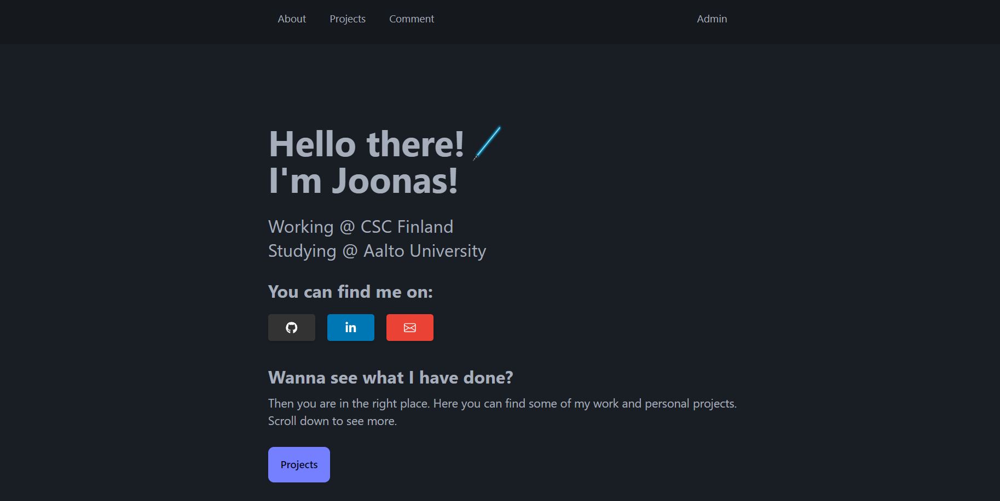

# Portfolio website

A simple portfolio website made with FastAPI, ReactJS, DaisyUI, and sqlalchemy. Configured for hosting the app and database on Vercel. You can check out a demo [here](https://www.jooniv.fi).



For running locally you need Python3 and NodeJs. To install all the required Node and python packages first clone the repository, navigate to the root and run

```
pip install -r requirements.txt
```

then navigate to the frontend directory and run

```
npm install
```

Next for the Google reCAPTCHA to work you need to setup some enviroment variables (defined in a .env file). For the frontend you need the VITE_SITE_KEY enviroment variable. This is your personal reCAPTCHA site key. For the backend reCAPTCHA needs the SITE_SECRET variable which is your reCAPTCHA site secret.

For the database you can use a postgresql of your choice. Just define the POSTGRES_URL_SQL_ALCHEMY variable as your database url.

Before proceeding also set the ADMIN_USERNAME and ADMIN_PASSWORD_HASH enviroment varibales for the backend. This allows for admin login. When logged in as an admin you can delete comments.

Then navigate to the root directory and run

```
uvicorn backend.main:app --reload
```

This starts the FastApi server which handles the backend api and serves the built frontend from the backend/static/ directory. The server will be available locally at http://localhost:8000

If for development purposes you wish to run the frontend on a separate server navigate to the frontend directory and run 
```
npm run dev
```

The frontend will then be availavle at http://localhost:5173.

You can now edit the frontend and the changes will be reflected on the browser. Once you are done and want to build the frontend, in the frontend direcotry, simply run 
```
npm run build
```

This will build the frontend and replace the backend/static/ directory with the new build.

If you wish to deploy to Vercel simply make a new project and connect it to your fork/clone of this repository.